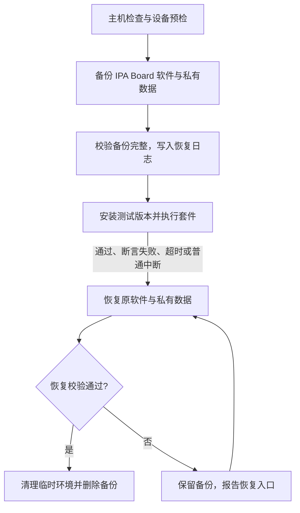

# 测试流程与维护规则

此流程取代 README、引擎文档中的直接设备测试命令。所有贡献者及自动化代理遵守仓库根目录的 [AGENTS.md](../AGENTS.md)。历史测试报告只说明当时的结果，不作为当前版本通过的依据。

## 必须保护测试机

**回归测试开始前需要备份测试机的软件状态与配置；回归测试完成后应该将测试机上的软件状态回滚至回归测试开始前，并删除备份。**

设备测试唯一入口是 `tools/regression.py`。Gradle 的 connected/managed-device 测试任务会拒绝直接执行，设备测试 runner 也拒绝缺少快照标识的调用。标识用于防止误操作，不是对恶意调用的安全认证；不得自行构造标识绕过备份。



用户已明确范围：**仅对 IPA Board 软件和软件产生的用户数据快照，不包含其他应用或系统设置。** 测试包是本工具的附属组件，原有安装也会复原。磁盘快照内容如下：

| 对象 | 备份及验证内容 |
| --- | --- |
| `com.example.ipa_board`、`.test` | 原有安装状态、全部 APK/split APK 及 SHA-256；原来没有安装的包在结束时移除。不会为解决签名不匹配而卸载原有应用。 |
| 应用数据 | CE/DE 私有目录，包括布局、设置、数据库、剪贴板历史、颜文字、已下载 Emoji、引擎部署资源、`no_backup`、缓存；验证路径类型、UID/GID、权限模式、时间戳及文件内容。APK 安装器管理的 `lib` 链接由原 APK 恢复；缓存目录的系统组及 setgid 属性也必须保留。 |

系统输入法配置、系统权限、app-op 及包启停等不写入快照。流程为了停止受测进程、暂时隔离 IPA 输入法而读取的环境状态只在内存中保留，在正常完成、断言失败、超时及普通中断后的清理中复原。突然断电或 SIGKILL 后，这些内存状态无法恢复；手动恢复仅承诺原 APK 与私有数据，不承诺回到原系统配置。

需要解锁的 owner user 0、可通过 `run-as` 读取的 debuggable 安装，以及支持恢复 stopped 状态的 Android 系统。不支持读取既有 release 私有数据时，改用专用模拟器；禁止卸载或清数据后继续。另一用户/工作资料中有同包安装时也停止。备份存放在主机临时目录的 `ipa-board-regression-<uid>/snapshot-*`，目录为 0700，不进入 Git；恢复日志按阶段原子保存，防止中途退出后丢失恢复入口。

这是上述持久化范围的恢复，不是整个操作系统的快照。既有进程的运行现场、用户原有编辑器文字、系统剪贴板、账户、密钥库、系统任务和其他应用数据不在此范围，自动套件不得修改其他应用的进程或用户文本。受测进程可以停止/重启，测试编辑器只用合成文字；不恢复此前进程的运行现场。需要扩大快照范围时先询问用户。专用只读模拟器还应关闭快照保存，避免退出时持久化测试修改。

## 执行步骤

先在主机完成确定性检查；不必连接设备：

```sh
python3 -m unittest discover -s tools -p 'test_*.py'
python3 tools/regression.py validate
python3 tools/verify_engine_assets.py
./gradlew testDebugUnitTest assembleDebug assembleDebugAndroidTest lintDebug --offline --console=plain
```

使用项目要求的 JDK 和已配置的 Android SDK。依赖未缓存时先解决构建环境，不要将设备数据清理当作构建排错步骤。

当前脚本自动运行 debug 变体。签名 release 的安装/运行验证须先提供符合上述应用快照范围的入口；本流程不会把 debug 结果当作 release 验证，也不允许为检查 release 绕过保护直接安装。

随后指定设备序列号（不要自动选择第一台设备）：

```sh
python3 tools/regression.py pending
python3 tools/regression.py run --suite smoke --serial DEVICE_SERIAL --no-build
python3 tools/regression.py run --suite full --serial DEVICE_SERIAL --no-build
```

排查完整套件时可加 `--keep-going` 收集所有普通 JUnit 断言失败/跳过，而不反复执行前缀。最终结果仍为失败并回滚；进程崩溃、没有完整结果、超时、中断或环境错误立即停止。报告列出实际执行/通过/失败/跳过数量，未执行的类不能算作通过。

维护回归脚本、修改备份逻辑或首次启用新测试机时，增加 `--verify-roundtrip`：在外层原状态备份保护下创建合成 CE/DE 文件、应用配置与缓存，取得内层已安装应用备份，再扰动这些私有数据，验证实际 APK/数据恢复后继续测试。内层失败会保留两层备份；外层恢复入口先处理内层，再恢复测试机原软件状态。此验证不使用用户输入或配置作为测试样例，也不扰动系统设置来验证快照。

`--no-build` 使用上一步构建的 APK，脚本仍核对包名、debuggable 和专用 runner。不提供时先离线构建两个 APK。流程如下：只读预检 → 在内存中保留临时环境并停止受测进程 → 复制/校验原 APK 和私有数据 → 写入已完成备份的日志 → 安装测试版本并隔离测试数据 → 按类执行所选套件 → 停止测试进程 → 恢复原 APK/数据 → 校验 → 清理临时环境 → 删除备份。恢复期间先临时隔离 IPA 输入法，避免它写入正在恢复的数据。

测试断言失败、超时、Ctrl-C、SIGTERM/SIGHUP 都进入恢复。恢复期间普通中断被延后；不要拔线或关闭测试机。SIGKILL、主机断电、设备掉线不能保证当场恢复，日志保留；下一次 run 遇到未完成备份会拒绝继续。

恢复失败时**保留备份**，不能把测试报告标为完成或手动删除唯一备份。重新连接原设备、解锁原用户后，使用脚本打印的路径：

```sh
python3 tools/regression.py pending
python3 tools/regression.py restore /PRIVATE/PATH/snapshot-XXXX --serial DEVICE_SERIAL
```

恢复入口校验原设备/系统构建和备份完整性，不会用不完整或损坏的 tar 覆盖原数据。备份只完成一部分、尚未开始安装/清数据时，不用不完整备份覆盖应用；跨进程恢复不读取不存在的历史系统设置。校验失败继续保留备份并报告原因；需要人工处理时先说明受影响对象和可恢复证据。正常回滚后备份目录删除，测试报告留在 `app/build/reports/regression/<id>/`。这些报告包含测试输出，亦不提交私人设备信息或配置。

## 套件及选择依据

清单由 [regression-suites.json](../tools/regression-suites.json) 管理。所有包含测试的设备类必须登记；`full` 是各主套件的并集，`smoke` 是其中的快速子集。校验禁止遗漏、重复归属和不存在的类。增加类时同步更新清单，不用手工维护总用例数。

| 层/套件 | 目的 | 触发时机 |
| --- | --- | --- |
| JVM + 工具主机测试 | Unicode/长按编码、候选拆分与排名、输入状态、配置编解码、版本解析；备份日志/校验/异常/中断/恢复失败路径 | 每次代码变更，提交前 |
| `smoke` | 组合输入、布局导入事务、引擎设置、快捷粘贴、主要控件可用性 | 每次影响运行行为的变更后 |
| `platform` | Android 真实文件/Preferences/InputConnection 合同、旧配置、组/页面存储、Emoji 缓存及版本查询生命周期 | 配置、数据、编辑器、异步逻辑变更 |
| `engines` | 实际 Rime/LatinIME/Mozc/注音：转换、简繁、纠错、混输、上下文预测、启停与回退 | 引擎适配、词库、native 依赖或候选逻辑变更 |
| `ui` | 设置/管理页、编辑器、清空撤销、长按滑动、候选尺寸/展开、灰色控件、窗口及页面分组 | 界面/资源/触摸逻辑变更 |
| `e2e` | 系统 IME 窗口中用真实按键输入、选择候选、切页/展开/返回、Emoji 提交 | IME/组合输入/页面导航变更及发布前 |
| `semantic` | 真实 E5 模型加载、光标前后文、失效结果拒绝、实时关闭/降级 | 语义模型、排序、协调器生命周期变更 |
| `full` | 以上所有设备主套件 | 集成前、升级引擎/词库后、发布前 |

普通回归不访问公网。Engine Management 的最新版本展示由测试 runner 注入固定元数据，异步查询另用注入的 transport、时钟及独立 cache 验证成功缓存、失败重试、关闭页面和并发取消。真实上游服务可达性属于单独的人工检查，失败不能与产品离线可用性混为一谈。

## 本次测试清理及增补

删除 `ExampleUnitTest`（2+2）、`ExampleInstrumentedTest`（包名）以及 `ClipboardQuickPasteTest`、`EmojiUpdateTest`。后两者主要比较硬编码常量或测试内复制的实现，不能证明生产快捷粘贴和更新流程正确。对应目的由真实生产入口的用例接替：

| 合同 | 新增/修订的覆盖 |
| --- | --- |
| 快捷粘贴 | 实际 service 状态、次数用尽、超时及关闭后旧回调不能粘贴/消耗次数，重新开启不能复活旧内容。保留发现缺陷的回归断言。 |
| 布局导入 | 无效/过大/读取中断不得改变文件、选择、页组、外观或 revision；成功导入长按半角逗号与功能映射，旧版本默认行为。 |
| 引擎开关 | 独立持久化、snapshot/Bundle 传递、全部原生功能关闭的行为、未知未来设置不被误删。 |
| Emoji | 实际安装目录的缺失/空/损坏/非法内容回退、有效目录与缓存失效；目录升级不依赖固定版本或总数量。 |
| 版本查询 | 成功缓存 5 分钟、失败缓存 30 秒及边界重试；关闭时不阻塞 UI、不发送旧页面回调、关闭后查询不抛异常。 |
| 错误诊断 | JVM 验证默认静默、即时关闭、嵌套加载阶段、固定词汇脱敏、失败输出隔离、限频及成功恢复。platform 验证独立偏好与进程快照、绑定拒绝/权限异常/失效回退、晚到回调及真实 E5 部署目录障碍；ui 验证调试开关操作和重建持久化。正常无候选、缺少可选目录、禁用引擎和过期结果不当作报错。Emoji 离线安装合同覆盖合法替换、无效文本与发布失败时原数据保留。规则及剔除入口见 [错误诊断说明](diagnostics.md)。 |
| 界面 | 候选最小尺寸随键盘几何变化、颜文字动作按键重复排序/管理切换后保持灰色；页面清空支持撤销。按键编辑器切换类型后仍能保存和取消，编辑区域限制高度并可滚动，避免动作按钮被裁切。剪贴板两列卡片跨行等大、列距缩小，超长预览出现省略号；长文和敏感条目的点击回调及测试编辑器仍收到完整 Unicode 原文。剪贴板倒序入口参照颜文字，验证完整序列翻转、按钮状态、刷新保留方向、正常顺序恢复和存储不变；左滑后排序/刷新不会重现等待撤销的条目，撤销和最终删除符合当前顺序；新增记录达到容量上限时，自动淘汰项不再显示无效撤销入口且不误删其余记录。复用状态栏时快捷粘贴与返回键盘后的原状态控件继续可用。 |
| 手势与快捷键 | 长按时间滑块由真实用户操作保存，重建页面和切换页组后保持全局时长；未配置或无效配置回退系统默认，越界配置限制在支持范围内。长按/滑动 fixture 与实际 IME 一样设置普通点击入口，验证同一按键的下一次触摸读取新时长、触发前仍为短按、松手仅提交长按项、取消后无残留计时任务。按用户确定的合同，Ctrl+Backspace、连续退格和配置绑定仍执行普通 Unicode 退格，消耗 Ctrl 状态，不发送按词删除事件。 |
| 英文上下文 | 不跨越其他文字/标点错误取词、系统 locale 不改变引擎输入、长词边界。 |
| 全半角转换 | JVM 覆盖宽度互换、混合方向、片假名浊音、孤立标记、无对应 Unicode 与键帽 Emoji 保留。Android 验证转换后的 composing 长度变化不污染引擎原编码和光标上下文、切换模式拒绝旧候选、提交失败后从原文重试、长文本及结束 composing 不重复转换；保留 Shift 大写、Ctrl 命令和原文粘贴合同。界面验证入口顺序与状态、短按/长按绑定保存及布局兼容；系统 IME 验证工具栏和绑定入口共用状态、换页仍有效，以及真实混输候选最终输出宽度。 |

保留配置编解码、文件事务、管理界面和实际 IME 分别覆盖同一功能的用例，因为它们验证不同边界。修正 Spinner 的显示名/文件名混淆、默认空格键及滑动映射、Emoji 当前分类/实际目录数量、旧 UI 标签和目标窗口定位。删除全屏截图；设备树定位限于受测包。恢复测试 fixture 时保留原 preference 的“缺失”状态，不把缺失擅自变为默认值。

端到端测试共用 `ImeTestDriver`：输入法切换后仅对测试自有编辑器请求显示，沿用原有总等待上限；候选在屏外时滚动到可见位置，异步重绘使点击返回 false 时重新取节点。点击一旦返回 true 就停止重试，并核对完整提交文本与 composing 已结束，防止重试造成重复提交或仅看到预输入原文便误判成功。E5 实时关闭测试等待各原生引擎重新查询后完整基础顺序恢复，不能把首个局部回复当作最终候选。

## 后续变更规则

1. 先写清输入/输出及失败/关闭时行为，再选择最小有效测试层；纯规则放 JVM，Android 存储放 platform，native 行为放 engines，实际窗口放 e2e。不要为每个常量或 getter 加测试。
2. 修复缺陷保留能复现错误的用例；旧测试失败先分类：合同过时、fixture/定位错误、环境不支持、产品缺陷。产品意图不清楚时列出原行为、当前界面/文档及两种选择，询问用户；不能删除测试掩盖问题。
3. 输入相关至少考虑 Unicode 码点、组合/直接输入切换、删除与重输、候选过期、全引擎关闭、跨语言及符号/数字边界。新增引擎验证缺失资源/启动失败时仍可原文提交。
4. 配置变更保留旧版本样例，并验证导入失败无副作用、升级/降级的数据保留和未知字段策略。恢复所依赖的私有数据结构变化要重跑工作流主机故障测试与实际回滚验证。
5. 异步测试用明确 latch/事件和可控时钟，避免 sleep、无限等待或为了通过而增加超时。引擎候选验证明确示例和保留性；不要宣称单例排名等同广泛语言质量。
6. 每个设备 fixture 用测试自有目录/配置，在 finally 中清理；不会替代外部快照。新增外部存储、账户、剪贴板写入、持久系统设置或其他应用交互前，先询问用户是否扩大范围，再增加恢复检查及故障用例，不能擅自把系统设置加入快照。
7. 报告记录源码 revision/工作树状态、构建变体、设备 API/ABI、套件与每类结果、测试失败/环境错误及回滚结果。只有测试通过且状态恢复验证通过才可报完成；零用例、崩溃、超时、跳过不能当作通过。

## 发布与人工验证

完整自动回归之外，发布时使用专用设备/模拟器检查以下边界，记录具体环境与结果：

| 场景 | 关注行为 |
| --- | --- |
| 普通文本、多行、密码、数字及无 composing 的编辑器 | 正确上屏/删除/光标；密码等受限框不读取上下文、不显示旧候选。使用测试编辑器及合成文字。 |
| API 35 与目标 API 36；ARM64 与 x86_64 | 真实引擎/模型加载及窗口行为。未执行的平台单独标为待验。 |
| 16KB 页设备 | native 依赖真实加载验证；资源哈希或 ELF 对齐检查不等于运行通过。现有 Mozc/Extensions 对齐限制见引擎文档。 |
| 更新安装及旧配置 | 新旧 APK 升级、原布局/长按/页组/开关/颜文字及 Emoji 目录保留；回滚后原 APK 与数据恢复。正式签名 release 单独验证，debug 通过不代表 release 通过。 |
| 短信本地检测/Android autofill、系统剪贴板与网络 Emoji 更新 | 合成来源、权限拒绝、误匹配、敏感内容、离线/损坏下载；SMS OTP 引擎与自动复制双开关、本地与 autofill 模式互斥、拒绝权限不重复复制。执行前需确认范围并补对应隔离/恢复能力，不使用真实短信和私人剪贴板。 |

当前审计发现 OTP 关键词子串可能误匹配，例如 `Your postcode is 1234` 或 `PINK shoes cost 1234`。这属于生产解析问题，不能通过断言错误行为或移除测试解决；保留为后续缺陷，新增反例并修正识别规则后验收。本次尚不将真实短信/系统剪贴板集成或广泛编辑器兼容性标为通过。

## 2026-10-03 验证记录

本次验证针对 `0.0.2-dev` 的开发工作树（基准提交 `64fc0fe`，包含未提交变更），不是已提交或发布版本。完整报告记录 debug APK 的 SHA-256，便于区分后续构建。

- JVM 单元测试 85 项、流程/套件校验主机测试 47 项全部通过；debug 应用和测试 APK 编译通过，lint 0 Error、255 Warning。
- 资源校验通过：87 项引擎文件哈希及 118,346,824 字节的 E5 模型重组校验。ELF 对齐检查不作为 16KB 页设备运行证明。
- 专用只读模拟器，Android 15 / API 35、`arm64-v8a`：`full` 的 28 类共 141 项全部通过，0 失败、0 跳过。报告为 `app/build/reports/regression/a2f31874-d701-4e67-9f89-a00f5433a39b/summary.json`，其中 `success=true`、`restored=true`。修订后的端到端套件也单独通过。
- 流程实际验证过已安装 APK 与合成 CE/DE 配置、文件、`no_backup` 和缓存数据的往返恢复，包括目录 UID/GID、setgid 属性、权限、时间戳及内容校验；恢复失败保留备份的路径也已恢复完成。最终完整回归已恢复原安装状态并删除备份。
- 本次未执行实体测试机、API 36、x86_64、16KB 页设备、签名 release、真实短信/剪贴板和广泛编辑器矩阵；这些仍按上方发布流程单独验收。

## 2026-10-08 错误诊断验证

先将此前功能进度提交为 `6dc3e14`；本次诊断验证针对其上的开发工作树。完整报告记录实际 debug APK 和测试 APK 的 SHA-256。

- JVM 单元测试 105 项、流程工具主机测试 47 项全部通过；debug 应用和测试 APK 编译通过，lint 0 Error、255 Warning，未新增 lint 警告。套件清单校验通过。
- 87 项引擎文件哈希及 118,346,824 字节 E5 模型重组校验通过，仍不作为 16KB 页设备运行证明。
- 专用只读模拟器，Android 15 / API 35、`arm64-v8a`：最终 `full` 的 29 类共 169 项全部通过，0 失败、0 跳过。报告为 `app/build/reports/regression/2d65ac9a-363a-4f32-bff5-c7079a8c70c6/summary.json`，其中 `success=true`、`restored=true`。覆盖实际 Rime/Mozc/LatinIME/E5、诊断故障与通信、开关 UI 及 Emoji 离线发布故障。
- 首轮报告 `app/build/reports/regression/d92a29b7-eb99-435e-aca2-10153c27ef6f/summary.json` 中，新增 UI 用例误将 `performClick()` 返回值当作开关生效条件，已改为验证实际选中状态和保存值；另有既有端到端用例在首次获取 IME 窗口时超时，原因尚未确定，完整重跑未再出现。没有删除用例、扩大等待上限或修改生产逻辑来掩盖失败；保留两轮报告区分首次失败和最终通过。
- 两轮均经保护工具备份、回滚和校验成功后删除备份；最终 `pending` 为空，专用模拟器已关闭。未执行实体机、API 36、x86_64、16KB 页设备、签名 release 或真实短信/剪贴板/公网更新检查。

## 2026-10-08 剪贴板倒序验证

- 新增 5 项设备回归，覆盖完整显示序列倒序及恢复、与颜文字一致的按钮样式、刷新保留方向、Unicode/敏感内容完整粘贴、快捷粘贴状态控件重新挂载、真实左滑撤销与提交删除，以及容量淘汰后无效 Undo 关闭。滑动用例登记在 `ui` 和 `full`，仅使用测试自有数据和视图。
- 最终 debug 应用与测试 APK 编译通过，JVM 单元测试 105 项、流程工具主机测试 47 项全部通过，lint 0 Error、255 Warning，未新增 lint 警告。引擎资源校验及套件清单校验通过。
- Android 15 / API 35、`arm64-v8a` 专用只读模拟器：最终 `full` 的 30 类共 174 项全部通过，0 失败、0 跳过；报告 `app/build/reports/regression/1bcf834e-714f-4de9-a35d-46ef57a2d649/summary.json` 中 `success=true`、`restored=true`。容量边界修复前的首轮 173 项也全部通过，保留报告 `app/build/reports/regression/a459adba-4973-445c-9072-1b8f1c5f9d70/summary.json` 区分构建版本。
- 两轮均已恢复并校验原软件安装状态与私有数据，之后删除备份；最终 `pending` 为空，模拟器已关闭。未执行实体机、其他 API/ABI 或真实系统剪贴板操作。
